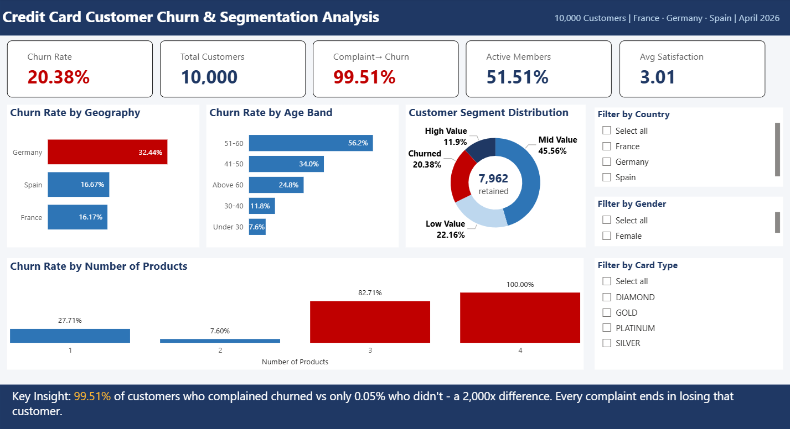
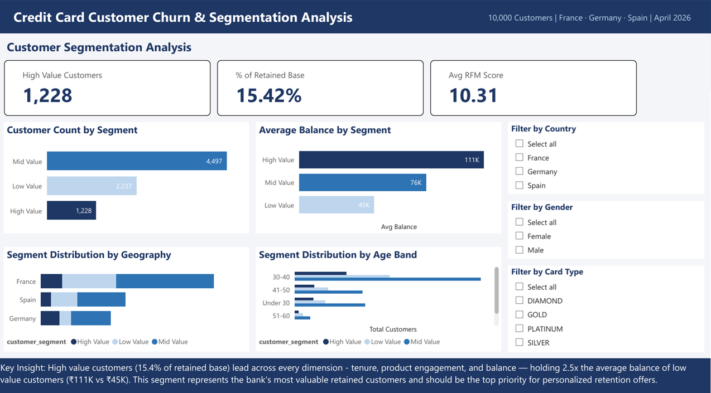
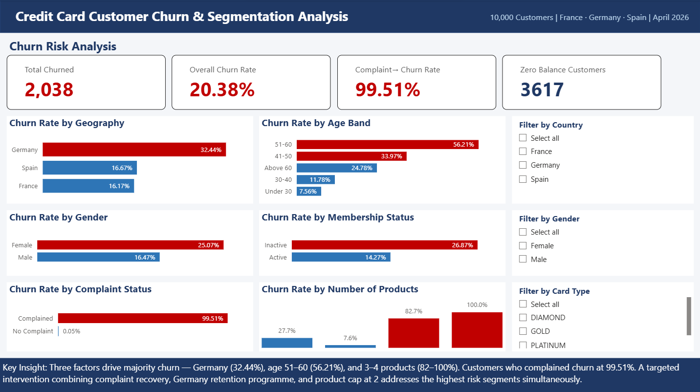

# Credit Card Customer Churn & Segmentation Analysis

## Business Problem
A European bank is experiencing a 20.38% customer churn rate. 
This project identifies the key drivers of churn, segments 
retained customers by value, and provides actionable 
recommendations to reduce attrition.

## Tools Used
- PostgreSQL — data cleaning, churn analysis, RFM segmentation
- Power BI — interactive dashboard with DAX measures
- GitHub — version control and project documentation

## Dataset
- Source: Kaggle — Bank Customer Churn Dataset
- Size: 10,000 customers, 18 columns
- Geography: France, Germany, Spain

## Key Findings
1. Germany has the highest churn rate at 32.44% 
   despite not being the largest market
2. 99.51% of customers who lodged a complaint subsequently 
   churned — indicating no effective complaint resolution process
3. Customers with 3-4 products churn at 82.71% - 100%  — 
   suggesting aggressive cross-selling backfires
4. Inactive members churn at nearly double the rate of 
   active members
5. High value customers represent 14.9% of the retained 
   base — 1,190 customers who require priority retention focus

## Database Tables
| Table | Rows | Purpose |
|-------|------|---------|
| credit_customers | 10,000 | Raw data |
| credit_customers_clean | 10,000 | Cleaned with derived columns |
| rfm_segments | 7,962 | Retained customer segmentation |
| powerbi_export | 10,000 | Power BI import table |
| kpi_summary | 1 | Monthly KPI snapshot |

## SQL File Guide
| File | Purpose |
|------|---------|
| 01_setup_and_first_look.sql | Table creation and initial exploration |
| 02_data_cleaning.sql | Null checks, range validation, clean table |
| 03_exploratory_analysis.sql | Customer distribution across all dimensions |
| 04_churn_analysis.sql | Churn rate by every segment |
| 05_rfm_segmentation.sql | RFM scoring and customer segmentation |
| 06_stored_procedure.sql | Monthly KPI stored procedure |

## Dashboard
## Dashboard Preview

### Page 1 — Executive Summary

### Page 2 — Customer Segmentation

### Page 3 — Churn Risk Dashboard

## Business Recommendations
1. Launch a Germany-specific retention programme immediately
2. Implement a complaint escalation and recovery process —
   current complaint-to-churn rate of 99.51% is critical
3. Cap product cross-selling at 2 products per customer
4. Create an active membership incentive programme for 
   inactive members